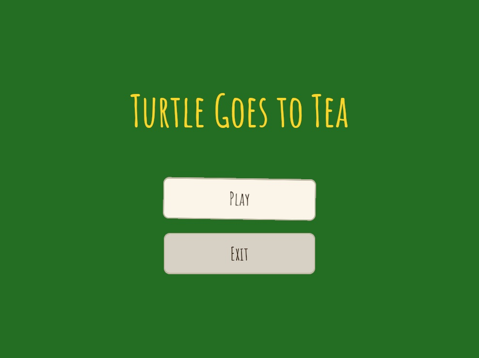
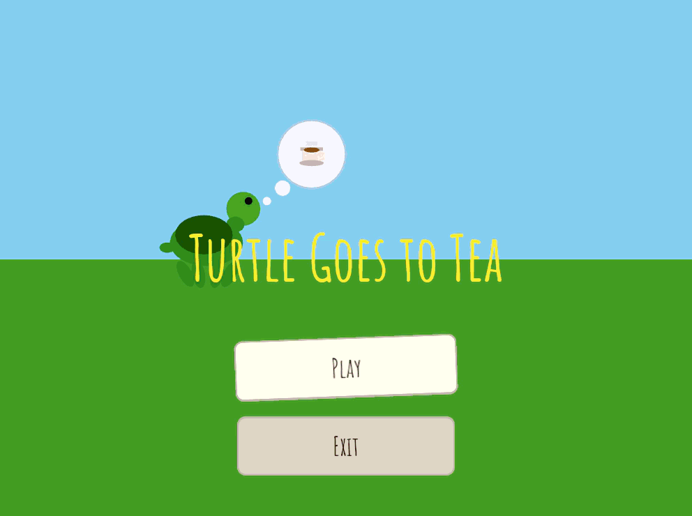

# Turtle Goes to Tea

A tiny Bevy game. Navigate the turtle to the tea. Drink tea. Win.





## Prerequisites

### 1. Install Rust

Go to https://rustup.rs and follow the instructions for Windows.  
This installs `rustup` (the toolchain manager), `rustc` (the compiler), and `cargo` (the build tool/package manager).

After installing, open a **new** terminal and verify:

```
cargo --version
```

### 2. Install Visual Studio C++ Build Tools (Windows only)

Rust on Windows needs the MSVC linker. If you don't have Visual Studio installed:

1. Download the **Build Tools for Visual Studio** from Microsoft's website.
2. In the installer, select **"Desktop development with C++"**.
3. Restart your terminal after installing.

### 3. Add a whimsical font (optional but recommended)

The game loads a font from `assets/fonts/whimsical.ttf`. Without it, Bevy falls  
back to its built-in monospace font, which works but isn't very cosy.

**Recommended:** [Amatic SC](https://fonts.google.com/specimen/Amatic+SC) — hand-drawn, gentle, very tea-appropriate.

1. Go to the link above → click **Download family**
2. Unzip the download
3. Copy `AmaticSC-Regular.ttf` into `assets/fonts/`
4. Rename it to `whimsical.ttf`

Any `.ttf` font works — feel free to pick your own from Google Fonts.

## How to Run

```
cd path\to\turtle-goes-to-tea
cargo run
```

> **First compile will take a while** — Bevy is a large crate.  
> Subsequent runs are much faster. The `Cargo.toml` already includes  
> optimization settings that cut dev compile times significantly.

## How to Play

| Action | Keys |
|---|---|
| Move turtle | Tap Arrow Left / Right, or A / D |
| Navigate menus | Arrow Up / Down, or W / S |
| Select | Enter, Space, or click |

Touch the turtle (circle) to the tea (square) to win.  
From the win screen you can play again, return to the main menu, or exit.

### Movement — it's all about rhythm

The turtle moves on **taps**, not holds. Each tap nudges it forward by a step that
grows or shrinks depending on how you're playing:

| Tapping style | Effect |
|---|---|
| Gentle rhythm (300–700 ms between taps) | Step size **grows** — turtle hops further each tap |
| Mashing (faster than 200 ms between taps) | Step size **shrinks** — turtle barely moves |
| Holding a key down | Momentum brakes almost instantly |
| Long pause (> 1.5 s) | Step size resets to neutral |

The sweet spot is roughly **one tap every half-second**. Rush it and you'll barely
move. Find the rhythm and the tea is yours in seconds.

## Project Structure

```
turtle-goes-to-tea/
├── assets/
│   └── fonts/
│       └── whimsical.ttf   ← drop your font here
├── Cargo.toml
└── src/
    └── main.rs
```

## Key Bevy Concepts Used

| Concept | What it does |
|---|---|
| `States` | Distinct app modes (Menu / Playing / Win) with clean enter/exit hooks |
| `OnEnter` / `OnExit` | Schedules that fire once when transitioning into or out of a state |
| `run_if(in_state(...))` | Limits an `Update` system to run only in certain states |
| `despawn_recursive` | Despawns an entity and all its children — used to tear down UI screens |
| `Node` | The UI layout component (flexbox-based) |
| `BackgroundColor` | Sets a UI node's fill color |
| `BorderRadius` | Rounds the corners of a UI node |
| `Button` + `Interaction` | Bevy's built-in hover/click detection for UI nodes |
| `Changed<Interaction>` | Query filter — only yields entities whose value changed this frame |
| `NextState<T>` | Resource used to request a state transition |
| `EventWriter<AppExit>` | Sends the built-in "please close the app" event |
| `AssetServer` | Loads files from the `assets/` folder at runtime |
